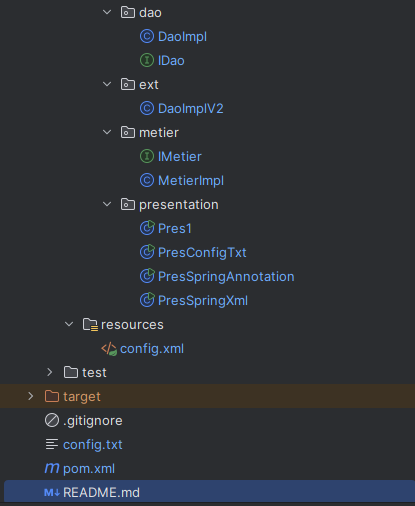

<h1>Injection de Dépendances en Java</h1>

<h3>Description</h3>
<pre>
Ce projet illustre l'injection de dépendances en Java en utilisant différentes approches :

Instanciation statique

Instanciation dynamique (config.txt)

Injection via Spring (XML & Annotations)
</pre>

<h3>Prérequis</h3>
<pre>
Java 17
Maven
Spring
</pre>

<h3>Structure du Projet</h3>
